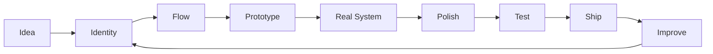

```mermaid
flowchart TB
  A[Max Ecosystem] --> B[Max Core]
  A --> C[Max Arena]
  A --> D[Max Archive]
  A --> E[Max Player / Max TV]
  A --> F[Max Stack]
  A --> G[MAX Files]
  A --> H[DuoDesk]
  A --> I[Discord Infrastructure]

  B --> B1[Private Media]
  B --> B2[Explore Logic]
  B --> B3[Two Account Base]

  C --> C1[Quick Duels]
  C --> C2[Ranked Seasons]
  C --> C3[Cards + Rewards]

  D --> D1[Encrypted Direction]
  D --> D2[Separate Identity]

  E --> E1[Movies / Series / Channels]
  E --> E2[World Cup Systems]
  E --> E3[Predictions + Alerts]

  F --> F1[Local Profiles]
  F --> F2[App Switching]
  F --> F3[Native Launcher]

  G --> G1[Glossy Mascot]
  G --> G2[File Dashboard]

  H --> H1[Screen / Clipboard]
  H --> H2[Private Two-Person Flow]

  I --> I1[Moderation]
  I --> I2[Automation]
  I --> I3[Logging]
```

<!--
  FaisalKSA966_README_MAX_OS_v4.md
  Premium GitHub profile README rebuilt for Faisal.
  Goal: not basic, not generic, no // headings, with Developer Mindset + Max projects.
-->

<div align="center">


<br />


<br /><br />

<picture>
  <source media="(prefers-color-scheme: dark)" srcset="https://readme-typing-svg.demolab.com?font=JetBrains+Mono&weight=800&size=29&duration=2200&pause=650&color=FFFFFF&center=true&vCenter=true&width=1040&height=64&lines=I+build+systems%2C+not+basic+pages.;Discord+bots%2C+automation%2C+security%2C+and+premium+UI.;Currently+building+the+Max+ecosystem.;Design+with+taste.+Ship+with+discipline." />
  
</picture>

<br />


<br /><br />


<a href="https://github.com/FaisalKSA966?tab=followers">
  
</a>
<a href="https://github.com/FaisalKSA966">
  
</a>
<a href="https://discord.com/users/6j.">
  
</a>

<br /><br />


<br />

<sub>
  <b>Full-stack logic, Discord infrastructure, automation systems, security-aware backends, and interfaces that do not look basic.</b>
</sub>

</div>

---

<div align="center">

## ✦ Identity Core

</div>

<table>
<tr>
<td width="58%" valign="top">

### General Info

I’m **Faisal**, a **14-year-old developer and product builder** focused on creating digital systems that feel polished, useful, and memorable.

My work is centered around **full-stack development**, **Discord bot systems**, **AI automation**, **backend architecture**, **cybersecurity awareness**, and **premium interface design**.

I do not like building projects that feel empty or copied. I care about the full product feeling: the structure, the flow, the visual identity, the speed, the permissions, the dashboard, and the small details that make something feel real.

Right now, one of my biggest directions is the **Max ecosystem** — a collection of private tools, media systems, desktop utilities, file experiences, game loops, and Discord-connected products.

</td>
<td width="42%" valign="top">

```txt
┌─ FAISAL / BUILDER CARD ───────────────────────┐
│ age        14                                  │
│ role       developer + product builder         │
│ focus      Discord systems + Max ecosystem     │
│ style      dark, premium, clean, sharp         │
│ mindset    build real systems, not templates   │
│ direction  automation, security, UI, backend   │
└────────────────────────────────────────────────┘
```

<div align="center">


</div>

</td>
</tr>
</table>

---

<div align="center">

## ★ Max Ecosystem

<sub>Current project universe: private systems, media tools, Discord automation, desktop utilities, game loops, and file products.</sub>

</div>

<table>
<tr>
<td width="50%" valign="top">

### Max Core

A private digital workspace built around media, identity, personal content, smooth navigation, and product-level UI.

- Private media library
- Explore / For You direction
- Internal tags and suggestions
- Two-account foundation
- Smooth navigation state
- Premium dashboard structure
- Personal product universe feeling

</td>
<td width="50%" valign="top">

### Max Arena

A game layer inside Max focused on quick duels, ranked progression, identity cards, banners, and reward loops.

- Ranked queue
- Micro-games loop
- Versus intro screens
- Result and rematch screens
- Cards, banners, badges
- Seasons and reward tracks
- Competitive identity system

</td>
</tr>
<tr>
<td width="50%" valign="top">

### Max Archive

A separate private archive direction with a darker identity, encryption-first thinking, and a clear split from the normal Max workspace.

- Private archive system
- Client-side encryption direction
- Separate mood and colors
- Upload and preview flows
- No public-feed feeling
- Built for sensitive storage
- Transition from Max into Archive

</td>
<td width="50%" valign="top">

### Max Player / Max TV

A media-player direction for movies, series, channels, events, match schedules, and premium watch experiences.

- Movies and series organization
- Channel-style navigation
- Event-based streaming ideas
- World Cup 2026 systems
- Match alerts and predictions
- Arabic / English presentation
- Discord-connected event flow

</td>
</tr>
<tr>
<td width="50%" valign="top">

### Max Stack

A local-first desktop utility for switching between app accounts and profiles without making it feel like a boring Windows template.

- Local-only direction
- App profile switching
- Isolation research
- Small premium launcher
- Native desktop UX
- No generic WebView look
- Built for real daily use

</td>
<td width="50%" valign="top">

### MAX Files

A file-platform direction with a softer identity, glossy file visuals, friendly mascot energy, and a clean dashboard experience.

- File-centered product identity
- Glossy 3D file mascot direction
- Modern file dashboard
- Premium banners
- Upload and browsing flow
- Strong visual memory
- Less boring cloud-storage feeling

</td>
</tr>
<tr>
<td width="50%" valign="top">

### DuoDesk

A private two-person workspace for screen sharing, clipboard sharing, files, presence, screenshots, and control tools.

- Two-person private room
- Screen and control direction
- Shared clipboard
- File drops
- Presence and status
- Private productivity flow
- Not a generic chat app

</td>
<td width="50%" valign="top">

### Discord Infrastructure

Advanced Discord systems built around moderation, automation, community flow, alerts, logging, predictions, and custom server experiences.

- Slash command architecture
- Moderation tools
- Role and permission systems
- Logging and analytics
- Event automation
- Community dashboards
- Server identity design

</td>
</tr>
</table>

<details open>
<summary><b>Open Max System Map</b></summary>



</details>

---

<div align="center">

## ◆ Product DNA

</div>

<table>
<tr>
<td align="center" width="25%">

### Taste

Interfaces should feel intentional, not generated.

<kbd>premium</kbd> <kbd>clean</kbd> <kbd>cinematic</kbd>

</td>
<td align="center" width="25%">

### Systems

Good products need structure behind the visual layer.

<kbd>logic</kbd> <kbd>state</kbd> <kbd>flows</kbd>

</td>
<td align="center" width="25%">

### Security

Backends should be safe from the start.

<kbd>permissions</kbd> <kbd>validation</kbd> <kbd>audit</kbd>

</td>
<td align="center" width="25%">

### Identity

Every project needs a visual memory.

<kbd>brand</kbd> <kbd>motion</kbd> <kbd>details</kbd>

</td>
</tr>
</table>

---

<div align="center">

## ✦ Developer Mindset

</div>

<table>
<tr>
<td width="33%" valign="top">

### Build With Purpose

I do not like empty features. A feature needs a reason, a place in the flow, and a clear feeling when someone uses it.

</td>
<td width="33%" valign="top">

### Design With Taste

A product can technically work and still feel dead. I care about spacing, rhythm, color, depth, motion, and small details.

</td>
<td width="33%" valign="top">

### Ship Real Systems

I prefer building things that can actually grow: proper structure, maintainable code, clear data flow, and UI that does not collapse after two features.

</td>
</tr>
<tr>
<td width="33%" valign="top">

### Secure By Default

Private systems should respect users from the beginning: permissions, validation, safe storage, and careful access patterns.

</td>
<td width="33%" valign="top">

### Avoid Basic Output

I do not want projects that look like templates. The goal is to make every build feel like it has its own universe.

</td>
<td width="33%" valign="top">

### Keep Iterating

The first version is never the final identity. I keep pushing the idea until it becomes sharper, cleaner, and more real.

</td>
</tr>
</table>

<div align="center">

> **Build with purpose. Design with taste. Secure by default. Scale with discipline.**

</div>

---

<div align="center">

## ◈ Current Build Console

</div>

```txt
┌─ CURRENT WORKSPACE ───────────────────────────────────────────────────────┐
│ 01  Max Core              private workspace + product identity            │
│ 02  Max Arena             duels, ranked loop, cards, seasons              │
│ 03  Max Archive           encrypted archive direction + separate mood     │
│ 04  Max Player / Max TV   movies, shows, channels, events, schedules      │
│ 05  Max Stack             local desktop account/profile switcher          │
│ 06  MAX Files             file dashboard + glossy mascot identity         │
│ 07  DuoDesk               two-person screen/control/files workspace       │
│ 08  Discord Systems       bots, moderation, logging, alerts, automation   │
└───────────────────────────────────────────────────────────────────────────┘
```

<table>
<tr>
<td width="50%" valign="top">

### What I Like Building

- Private tools for a small number of people
- Dashboards that feel expensive and smooth
- Discord systems and automation flows
- Media systems, archives, and file experiences
- Game loops with ranks, cards, and rewards
- Local-first desktop utilities
- Interfaces with personality, not default templates

</td>
<td width="50%" valign="top">

### What I Avoid

- Generic landing pages
- Empty AI-looking content
- Copy-paste dashboard layouts
- Overly formal product writing
- Features that sound cool but do nothing
- Basic MVPs that never grow
- UI with no identity or emotional impact

</td>
</tr>
</table>

---

<div align="center">

## ✦ Tech Stack

</div>

<table>
<tr>
<td align="center" width="25%">

### Frontend


</td>
<td align="center" width="25%">

### Backend


</td>
<td align="center" width="25%">

### Systems


</td>
<td align="center" width="25%">

### Creative


</td>
</tr>
</table>

<div align="center">


</div>

---

<div align="center">

## ✦ Engineering Zones

</div>

<table>
<tr>
<td width="25%" align="center" valign="top">


### Discord Systems

Bots, slash commands, moderation, logging, roles, permissions, alerts, server flows, and community automation.

</td>
<td width="25%" align="center" valign="top">


### AI Automation

Workflow tools, smart assistants, internal product logic, automation flows, and useful AI-connected systems.

</td>
<td width="25%" align="center" valign="top">


### Secure Backends

Authentication, validation, permissions, safe config handling, audit logs, and cleaner server architecture.

</td>
<td width="25%" align="center" valign="top">


### Premium UI

Dark dashboards, cinematic layouts, product motion, spacing, visual identity, and less generic interfaces.

</td>
</tr>
</table>

---

<div align="center">

## ✦ Featured Systems

</div>

<table>
<tr>
<td width="50%" valign="top">

### OpticAI

A product-focused AI platform direction centered around automation, intelligent workflows, assistant logic, and scalable product structure.

**Focus:** AI flows, dashboard UX, backend architecture, automation logic.


</td>
<td width="50%" valign="top">

### Flowline

A startup and workflow innovation direction built around organized execution, productivity systems, and product planning.

**Focus:** workflows, product execution, operations, dashboards, startup tooling.


</td>
</tr>
<tr>
<td width="50%" valign="top">

### Discord Bot Systems

Advanced Discord bot ecosystems for custom communities, moderation, server protection, role flows, automation, and analytics.

**Focus:** Discord.js, command architecture, permissions, logs, moderation, automation.


</td>
<td width="50%" valign="top">

### Security Toolkit

Security-aware utilities and backend patterns designed around safer defaults, validation, permission control, and audit-friendly systems.

**Focus:** auth, validation, access control, config safety, reports, risk awareness.


</td>
</tr>
</table>

---

<div align="center">

## ✦ Build Loop

</div>



---

<details open>
<summary><b>Lab Notes</b></summary>

<br />

<table>
<tr>
<td width="33%" valign="top">

### UI Rules

- Dark premium first
- Rounded but not childish
- Smooth spacing
- Strong visual hierarchy
- No empty “AI slop” text
- Every screen needs a reason

</td>
<td width="33%" valign="top">

### System Rules

- Clean architecture
- Useful state flow
- Safe defaults
- Clear permissions
- Maintainable modules
- Features that can grow

</td>
<td width="33%" valign="top">

### Product Rules

- Identity before templates
- Real use before hype
- Motion with purpose
- Privacy where it matters
- Details make it memorable
- Keep improving the universe

</td>
</tr>
</table>

</details>

---

<div align="center">

## ✦ GitHub Telemetry


<br /><br />


</div>

---

<div align="center">

## ✦ Contribution Activity


</div>

---

<div align="center">

## ✦ Trophy Wall


</div>

---

<div align="center">

## ✦ Contact

<a href="https://github.com/FaisalKSA966">
  
</a>
<a href="https://discord.com/users/6j.">
  
</a>

<br /><br />


<br /><br />


</div>
